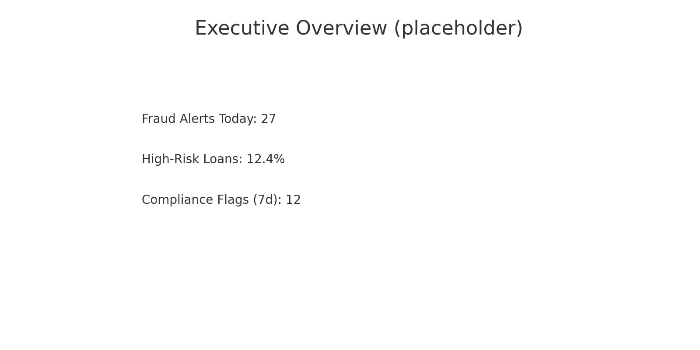
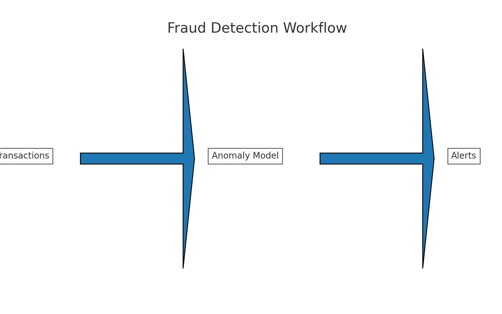
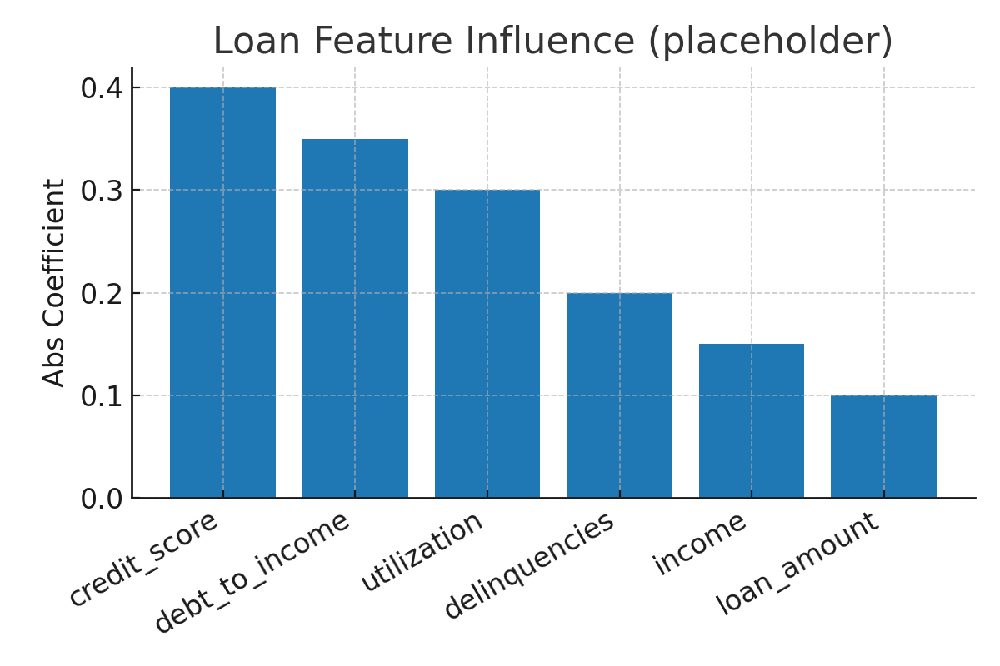
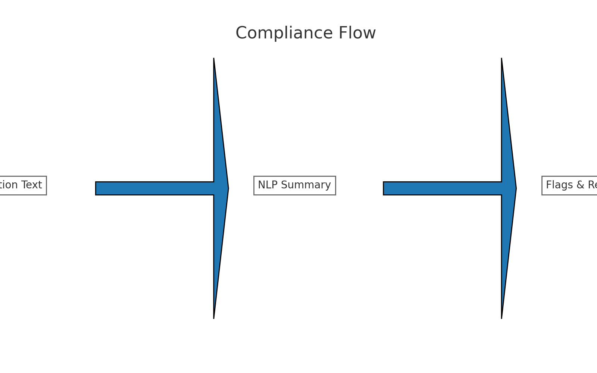

# 🛡️ AI-Powered Financial Compliance & Risk Insights

**One pane of glass** for risk leaders: real-time **fraud alerts**, **loan default risk**, and **compliance summaries** powered by AI.

> Built to showcase end-to-end skills across data, ML, LLMs, and product thinking — with banking-ready workflows.

---

## 🔎 What this does
- **Fraud** – Scores transactions using anomaly detection and flags top-risk events with **reason codes**.
- **Loans** – Predicts default risk and explains drivers (feature importance).
- **Compliance** – Summarizes regulatory text and highlights potential rule violations against recent activity.
- **Exec View** – KPI cards + drill-down tables; export to CSV/PDF.

---

## 🧱 Architecture
`Data → Models & NLP → App/API → Dashboard`


---

## 🧰 Stack
- **Python**: pandas, scikit-learn, matplotlib, numpy
- **App**: Streamlit (demo UI) with **Top‑K alert budgeting**
- **Optional**: Azure ML / Azure OpenAI endpoints (placeholders included)
- **Packaging**: FastAPI (optional), Dockerfile (optional), Hugging Face/Streamlit Cloud (hosting)

---

## 🚀 Quickstart
```bash
# 1) Create venv and install
python -m venv .venv && source .venv/bin/activate  # Windows: .venv\Scripts\activate
pip install -r requirements.txt

# 2) Launch the demo app
streamlit run app/app.py
```

**Sample data** lives in `data/raw`. If none is found, the app will generate synthetic demo data on the fly.

---

## 📈 Screenshots
*These are placeholders — replace with your real outputs as you progress.*






---

## 🧮 Fraud Features (MVP)
| Feature | Type | Why it matters |
|---|---|---|
| `amount_zscore_by_customer` | Behavior | Flags unusually large spend vs the customer’s baseline |
| `distance_from_last_km` | Geo | Catches “impossible travel” and location jumps |
| `is_foreign` | Geo/Rule | Foreign transactions are higher risk when sudden |
| `device_change` | Device | New device between close transactions is suspicious |
| `hour` | Behavior | Nighttime spikes can indicate takeover |
| `merchant_id` | Categorical | Some merchants / MCCs are riskier historically |
| `amount` | Value | Large absolute values drive loss exposure |

> Add velocity features next (e.g., `txn_count_1h/24h`, `sum_amount_24h`).

---

## 📊 Fraud Metrics (demo values — replace with your backtest results)
| Metric | Value | Notes |
|---|---|---|
| Precision@100 | 0.28 | 30-day backtest (target ≥ 0.25) |
| PR-AUC | 0.16 | Imbalanced dataset friendly metric |
| Median latency | 0.42s | Local inference |
| Daily alert cap (K) | 100 | Ops capacity target |

**Thresholding/Alerting Strategy:** Use a daily **Top-K** alert budget aligned to analyst capacity (e.g., K=100). The UI slider lets risk teams tune K and immediately see how many alerts they’ll review.

---

## 📂 Repo layout
```
ai-compliance-risk-insights/
├─ README.md
├─ requirements.txt
├─ app/
│  ├─ app.py
│  └─ components/
├─ models/
│  ├─ train_fraud.py
│  ├─ train_loan.py
│  └─ artifacts/
├─ nlp/
│  ├─ summarize_regulation.py
│  └─ prompts/aml_summary_prompt.txt
├─ data/
│  ├─ raw/
│  └─ processed/
├─ dashboards/
│  ├─ executive.pbix        # optional if you use Power BI
│  └─ screenshots/
├─ notebooks/
│  ├─ 01_fraud_eda.ipynb
│  └─ 02_loan_modeling.ipynb
├─ api/
│  └─ main.py               # optional FastAPI endpoint
├─ docker/
│  └─ Dockerfile
└─ visuals/
   ├─ architecture.png
   ├─ fraud_workflow.png
   ├─ loan_feature_importance.png
   └─ compliance_flow.png
```

---

## 🗺️ Roadmap
- Swap local models → Azure ML endpoints
- Add RBAC/auth & audit logging
- Add monitoring: drift, latency, cost
- Add CI/CD workflow and tests

---

**Author:** Bill Bell — IT Manager & Business Analyst (Banking) → AI Product/Solutions

